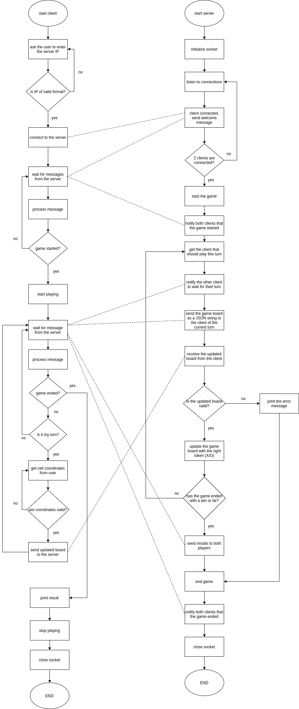

# Application Documentation:

The application is a 2-player Tic-Tac-Toe terminal game that is played between 2 clients over a network and mediated by a server.

The code is divided into 2 packages, "Client" and "Server" packages, as follows:

## Server package:

### Classes:

Four classes are used for the Server package:

1. Player: A class that represents a tic-tac-toe player.
2. Client: A class that represents a client connecting to the server. This class extends the Player class above.
3. Game: A class that represents a tic-tac-toe game.
4. Server: A class that represents the server of the game.

A Game instance is composed of 2 Player instances. However, we are provding the Game class constructor method with 2 Client instances that act as Player instances (since the Client class extends the Player class).

A Server instance is composed of a list containing 2 Client instances. The Server class initializes an instance of the Game class to run the game session, and provides the 2 Client instances to the Game constructor during the initialization.

### Python Dependencies:

Only 2 standard libraries are used for the Server package:

1. socket: To create a socket, listen to connections and send/receive messages over the network.
2. json: To transform the game baord to/from a JSON-encoded string for transmission over the network.

### Communication Protocol:
The server sends different messages to clients to orchestrate the gameplay as follows:

1. "START": is sent to let the clients know that the game started.
2. A JSON-encoded string representation of the board: informs the client what is the board currently like. This message also notifies the client that it is their turn to play.
3. "WAIT": is sent to let the client know that it is their opponent's turn to play.
4. "WON": is sent to let the client know that they won the game. This message also notifies the client that the game has ended.
5. "LOST": is sent to let the client know that they lost the game. This message also notifies the client that the game has ended.
6. "TIE": is sent to let the client know that the game resulted in a tie. This message also notifies the client that the game has ended.
7. Any other messages sent are printed as is for the user to see. These messages also notify the client that the game has ended.

The client sends only one message to the server, which is a JSON-encoded string representation of the updated board.

### Algorithm explanation:

The algorithm on the server side goes as follows:

1. Initialize the socket and start listening for connections.
2. Whenever a client is connected, greet them with a welcome message.
3. If 2 clients are connected, start the game.
4. Create an instance from the Game class and pass both clients as the players of the game.
5. Notify both clients that the game has started by sending them the message "START".
6. Determine which client should play this turn and send the message "WAIT" to the other client.
7. Get the current board from game instance, transform it into a JSON-encoded string and send it to the client.
8. Receive the updated board from the client, decode it back from the JSON-encoded string and validate it.
9. If the board is not valid, send an error message to both clients and go to step 13.
10. Update the board of the game instance accordingly and check if the game ended with a win or a tie.
11. If the game did not end: go back to step 6 with changing the turns of the players.
12. Send the results to both clients by sending each client one of the three messages: "WON", "LOST" or "TIE".
13. End the game session, notify both clients that the game ended and close the socket.

## Client package:

### Classes:

Two classes are used for the Client package:

1. Client: A class that represents a client playing the game.
2. GameHelper: A class that helps the client to play the tic-tac-toe game over the network.

The Client class initializes an instance of the GameHelper class to help play the game during the whole game session.

### Python Dependencies:

Four standard libraries are used for the Client package:

1. socket: To create a socket, connect to the server and send/receive messages over the network.
2. json: To transform the game baord to/from a JSON-encoded string for transmission over the network.
3. os: To clear the terminal before printing.
4. re: To validate the IP address provided by the user based on a regular expression.

### Algorithm explanation:

The algorithm on the client side goes as follows:

1. Initialize the socket and connect to the server.
2. Wait for messages from the server.
3. Process the message and print the appropriate output to the terminal.
4. Based on the previous processing step, check if the game started when the received message is "START".
5. If the game did not start yet, go back to step 2.
6. If the game started, print the appropriate message to the terminal and prepare to start playing.
7. Wait for new messages from the server.
8. Process the received message based on the commuication protocol (described before).
9. If the game ended, go to step 18.
10. Check if it is my turn.
11. If it is not my turn, go back to step 7.
12. The message received is the JSON-encoded string representation of the game board. Decode the board from the JSON-encoded string.
13. Print the board to the terminal.
14. Ask the user to input the coordinates of the cell to fill.
15. If the coordinates are not valid, go back to step 14.
16. Update the board at the selected coordinates, transform the board to a JSON-encoded string and send the string back to the server.
17. Go back to step 7.
18. Print a proper message if the message was one of the three messages: "WON", "LOST" or "TIE". Otherwise, print the message as is.
19. End the game session and close the socket.

## Flow Chart

Both the client and server algorithms, and their interactions, are represented in detail in the following flow chart:

